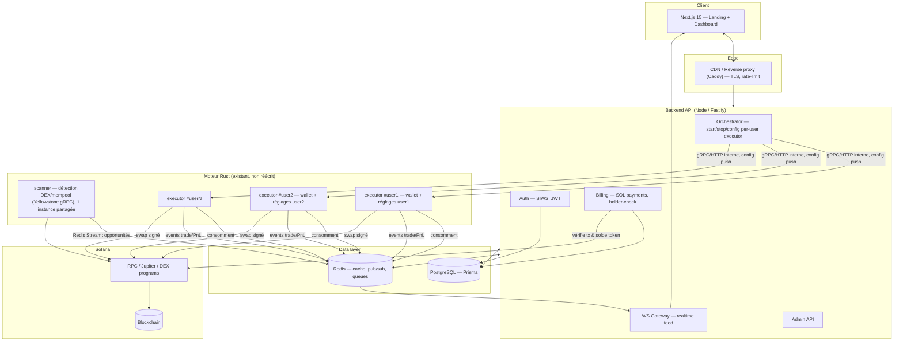

# PABLO — Architecture SaaS
### De moteur Rust CLI à plateforme Web3 premium

> **Statut : décisions validées le 2026-07-17.** Ce document est la référence
> de conception. Le detail de ce qui est *construit* (par opposition à
> *décidé*) vit dans les README de chaque app et dans les commits — voir
> §14 pour l'avancement par phase.

---

## 0. Ce que j'ai trouvé en disséquant le moteur

Avant de proposer quoi que ce soit, j'ai lu le code réel dans `Solana-Sniper-Bot-master` (pas la doc — le code). Ça change des choses importantes pour l'architecture.

**Ce que le moteur fait déjà, et bien :**
- Détection temps réel via **Yellowstone gRPC** (mempool/logs), deux moniteurs en parallèle : copy-trading de wallets cibles (`start_target_wallet_monitoring`) et sniping DEX (`start_dex_monitoring`)
- Adapters natifs pour **PumpFun, PumpSwap, Raydium (AMM/CLMM/CPMM/Launchpad), Meteora (DBC/DAMM)**
- Moteur de vente sophistiqué (`selling_strategy.rs`, ~2400 lignes) : take-profit, stop-loss, **trailing stop dynamique par palier de PnL**, détection de wash trading, ventes d'urgence sur mouvement de whale, sortie temporelle
- Liquidation via **Jupiter API**
- Cache en mémoire (DashMap) pour comptes de tokens, mint, séries temporelles 20-slots pour détection de "bottom"

**Ce que le moteur n'a PAS, et qui conditionne tout le reste :**
- **Aucune API.** C'est un binaire CLI. Il lit `.env` une fois au démarrage (`dotenv()` + `OnceCell<Mutex<Config>>` global) et tourne. Pas de serveur HTTP, pas de WebSocket, pas de moyen d'interagir avec lui une fois lancé sans le redémarrer.
- **Un seul wallet, un seul jeu de réglages, par processus.** `PRIVATE_KEY` est une variable d'env unique. Toute la config (TP/SL, montant, slippage, cibles de copy-trading, blacklist) est figée au boot.
- **Aucune persistance.** Les positions, l'historique, les métriques vivent dans des `DashMap` en RAM. Si le process redémarre, tout est perdu — il n'y a ni base de données ni fichier de sortie structuré.
- **Aucune notion de multi-utilisateur.** L'état global (`WALLET_TOKEN_ACCOUNTS`, le cache de séries temporelles, `Config`) est partagé par tout le processus. Faire tourner ce binaire tel quel pour plusieurs utilisateurs dans un seul process n'est pas sûr : les positions et wallets se mélangeraient.

**Conséquence directe :** on ne peut pas juste "brancher une API dessus" et avoir une SaaS multi-abonnés en un après-midi. Il y a deux vraies décisions d'architecture à trancher avant la moindre ligne de code — je les pose ci-dessous avec ma recommandation, mais ce sont vos choix.

---

## 1. Les deux décisions qui déterminent tout — validées

### Décision A — Topologie d'exécution (comment un même moteur sert N abonnés) ✅ validée : A2

| | **Option A1 — Une instance complète par abonné** | **Option A2 — Détection partagée + exécution par utilisateur** (recommandé) |
|---|---|---|
| Principe | Chaque abonné Premium = 1 container avec son propre process moteur, son propre flux Yellowstone gRPC, son propre wallet | Un (ou quelques) process "Scanner" fait tourner `start_dex_monitoring` **une seule fois**, publie les opportunités détectées sur une queue Redis. Un "Executor" léger par utilisateur (réutilise `execute_buy`/`execute_sell`/`selling_strategy` comme librairie) consomme la queue et applique les réglages propres à chaque abonné |
| Fidélité au moteur | Zéro changement structurel : on lance N fois le binaire existant avec un `.env` différent | Nécessite de séparer la boucle `main.rs` (détection) de l'exécution — **on ne touche à aucune logique de trading, DEX, parsing ou vente**, seulement à l'orchestration du point d'entrée |
| Coût infra | **Linéaire et élevé.** Un flux Yellowstone gRPC dédié coûte typiquement 100-300$/mois par abonnement chez Shyft/Helius. À 50 abonnés payant 10$/mois, l'infra de détection seule coûte 5 000-15 000$/mois. Économiquement non viable au prix annoncé. | Un seul flux gRPC partagé, quel que soit le nombre d'abonnés. Coût de détection fixe, coût d'exécution marginal (RPC calls uniquement, peu coûteux) |
| Copy-trading multi-cibles | Trivial, chaque instance suit ses propres wallets cibles | Un peu plus de travail : il faut dédupliquer les wallets cibles suivis par plusieurs abonnés dans le scanner, mais c'est directement dans l'esprit du code existant (le moteur supporte déjà `IS_MULTI_COPY_TRADING`) |
| Isolation | Parfaite (containers séparés) | Bonne : le scanner ne touche jamais aux fonds, seul l'executor par utilisateur signe des transactions, dans un container/process isolé par utilisateur |

**Ma recommandation : A2.** À 10$/mois par abonné, A1 tue le business model dès qu'il y a plus de quelques utilisateurs actifs simultanément. A2 est aussi, techniquement, ce que font BullX/Photon/Bloom : un moteur de détection centralisé, une exécution personnalisée par compte.

Note d'implémentation validée : le côté "détection ne monte jamais en plusieurs instances" est une invariante d'infra (un seul déploiement `scanner`), pas une limite technique du code — le binaire `scanner` pourrait physiquement tourner plusieurs fois, mais l'orchestrateur ne le permet jamais. Le chemin `scanner → Redis Stream (consumer groups) → executor-*` est ce qui permet de monter à plusieurs milliers d'utilisateurs sans retoucher cette topologie : chaque nouvel abonné n'ajoute qu'un `executor` léger (process/container, pas un nouveau flux gRPC), donc le coût et la charge de détection restent plats quel que soit N.

Concrètement, ça veut dire créer un nouveau module `apps/engine-bridge/src/bin/scanner.rs` et `.../bin/executor.rs` qui **réutilisent** `dex/`, `processor/swap.rs`, `processor/selling_strategy.rs`, `processor/transaction_parser.rs`, `library/jupiter_api.rs` tels quels comme une librairie (le `Cargo.toml` du moteur a déjà un `lib.rs` — c'est prévu pour ça), et remplacent uniquement l'orchestration de `main.rs`.

### Décision B — Modèle de garde des fonds (custody) ✅ validée, avec choix utilisateur

Le moteur a besoin d'une clé privée pour signer. Le cahier des charges demande une "connexion multi-wallet" pour l'authentification. Ce sont **deux wallets différents avec deux rôles différents** :

- **Wallet d'identité** (Phantom / Solflare / Backpack / OKX via wallet-adapter) : sert à se connecter (signature de message, pas de clé exposée), à payer l'abonnement en SOL, et à prouver la détention de $PABLO. Ce wallet ne signe **jamais** une transaction de trading. C'est celui de l'utilisateur, non-custodial, la plateforme n'y touche jamais.
- **Wallet de trading** : c'est lui qui exécute les snipes, toujours détenu côté serveur (chiffré, enveloppe KMS/Vault) car un bot ne peut pas attendre une signature Phantom à chaque trade sans tuer l'edge de vitesse. Deux origines possibles, **au choix de l'utilisateur**, dans la page Wallet du dashboard :
  1. **Généré automatiquement** (par défaut, recommandé) — la plateforme crée un keypair dédié pour cet abonné.
  2. **Importé** — l'utilisateur colle la clé privée d'un wallet de trading qu'il possède déjà. Le stockage et le chemin de signature sont **identiques** aux deux cas une fois la clé en base (`TradingWallet.custody = GENERATED | IMPORTED`, colonne `encryptedPrivateKey` chiffrée dans les deux cas) — seule l'origine diffère. La clé transite en HTTPS, est chiffrée côté serveur immédiatement à réception, jamais journalisée, jamais renvoyée en clair après import (seule la clé publique est ré-affichable).

Clé privée : jamais en clair en base ou en logs, déchiffrée uniquement en mémoire dans le container `executor` de l'utilisateur au démarrage. Dépôt/retrait de SOL explicite depuis la page Wallet.

---

## 2. Vue d'ensemble



---

## 3. Structure du monorepo

```
pablo/
├── apps/
│   ├── web/                      # Next.js 15 (App Router) — landing + dashboard + admin
│   │   ├── app/
│   │   │   ├── (marketing)/      # landing page publique
│   │   │   ├── (dashboard)/      # zone abonné, protégée
│   │   │   │   ├── sniper/
│   │   │   │   ├── portfolio/
│   │   │   │   ├── history/
│   │   │   │   ├── wallet/
│   │   │   │   ├── analytics/
│   │   │   │   ├── settings/
│   │   │   │   └── support/
│   │   │   ├── (admin)/          # zone admin, rôle-protégée
│   │   │   └── api/auth/         # routes NextAuth-like si besoin (proxy vers backend)
│   │   ├── components/
│   │   │   ├── ui/               # shadcn/ui, tokens PABLO
│   │   │   ├── charts/           # Recharts wrappers
│   │   │   └── wallet/           # wallet-adapter UI
│   │   └── lib/
│   │
│   ├── api/                      # Backend Fastify (Node/TS)
│   │   ├── src/
│   │   │   ├── modules/
│   │   │   │   ├── auth/         # SIWS, JWT, refresh
│   │   │   │   ├── billing/      # paiement SOL, holder-check, abonnement
│   │   │   │   ├── orchestrator/ # gestion des executors (start/stop/config)
│   │   │   │   ├── sniper/       # proxy REST vers scanner (feed d'opportunités)
│   │   │   │   ├── portfolio/
│   │   │   │   ├── trades/
│   │   │   │   ├── notifications/
│   │   │   │   └── admin/
│   │   │   ├── ws/                # gateway websocket (feed live)
│   │   │   ├── jobs/              # BullMQ: holder-check cron, payment poller, grace period
│   │   │   └── plugins/           # fastify plugins (jwt, cors, rate-limit, helmet)
│   │   └── prisma/
│   │       └── schema.prisma
│   │
│   └── engine-bridge/             # NOUVEAU — sidecar Rust, PAS le moteur lui-même
│       ├── Cargo.toml             # dépend de `engine` comme lib (path dependency)
│       └── src/
│           ├── bin/scanner.rs     # orchestration détection, réutilise engine::dex, engine::processor::*
│           ├── bin/executor.rs    # orchestration exécution par utilisateur
│           └── api/               # Axum: /config (PUT réglages), /health, /events (WS interne)
│
├── engine/                        # LE MOTEUR EXISTANT — importé tel quel, code de trading INTOUCHÉ
│   ├── Cargo.toml                 # `[lib]` ajouté pour exposer dex/, processor/, library/ comme crate
│   └── src/
│       ├── lib.rs                 # déjà présent — inchangé
│       ├── dex/                   # inchangé
│       ├── processor/             # inchangé (swap.rs, selling_strategy.rs, sniper_bot.rs, ...)
│       ├── library/                # inchangé
│       └── common/                 # config.rs adapté pour construction par valeurs (voir §4), pas par process
│
├── packages/
│   ├── shared-types/               # types TS générés/partagés (zod schemas, DTO) entre web et api
│   └── config/                     # eslint/tsconfig/tailwind presets communs
│
├── infra/
│   ├── docker/                     # Dockerfiles: web, api, scanner, executor
│   ├── docker-compose.yml          # stack de dev complète
│   └── k8s/ (optionnel, phase ultérieure)
│
├── docs/
│   └── ARCHITECTURE.md             # ce document
│
├── turbo.json / pnpm-workspace.yaml
└── package.json
```

**Important sur `engine/` :** ce dossier reçoit une copie fidèle du code source fourni. La seule modification tolérée est `common/config.rs`, et seulement pour remplacer le `OnceCell<Mutex<Config>>` global (conçu pour un seul process) par une construction de `Config` **par valeurs**, passée en paramètre plutôt que lue globalement — un changement mécanique de plomberie, zéro logique métier touchée. Tout le reste (`dex/`, `processor/swap.rs`, `processor/selling_strategy.rs`, `processor/sniper_bot.rs`, `library/jupiter_api.rs`, `transaction_parser.rs`...) reste identique au caractère près.

---

## 4. Le pont Engine ↔ Backend — ce qu'on ajoute exactement

Trois ajouts, tous en périphérie, aucun dans la logique de trading :

1. **`engine/src/common/config.rs`** : `Config::new()` prend un struct de paramètres au lieu de lire `env::var` directement. Le `.env` reste un fallback pour le dev local. En prod, le backend pousse la config via l'API du sidecar.

2. **`engine-bridge`** (nouveau crate, Axum) :
   - `PUT /config` — reçoit les réglages depuis le backend (montant/achat, TP, SL, trailing stop, slippage, priority fee, blacklist/whitelist, copy-trading targets, auto-sell) et les applique au `Config` en mémoire de l'executor de cet utilisateur. Le moteur a déjà des setters implicites pour la plupart de ces valeurs (`SellingConfig`, `SwapConfig`, `RiskManagementConfig`) — on les rend appelables à chaud au lieu de figées au boot.
   - `POST /control/start`, `POST /control/stop` — démarre/arrête les boucles de monitoring pour cet utilisateur.
   - `GET /health` — pour l'orchestrateur.
   - `GET /events` (WebSocket interne) — un point d'ancrage d'événements est ajouté aux endroits où `selling_strategy.rs::record_trade_execution` et `sniper_bot.rs::execute_buy/execute_sell` concluent déjà une transaction (elles logguent déjà le résultat avec `Logger` — on ajoute un `tx.send(TradeEvent {...})` juste à côté du `logger.log(...)` existant). Ces événements remontent vers Redis pub/sub, que le backend relaie en WebSocket au dashboard.

3. **Orchestrateur backend** : au moment où un utilisateur devient Premium (paiement validé ou holder détecté), le backend lance (Docker) un container `executor` dédié avec le wallet et les réglages de cet utilisateur, et le connecte au flux Redis du `scanner`. À la perte du Premium, le container est stoppé (funds restent dans le wallet custodial, retirables).

---

## 5. Modèle de données (PostgreSQL / Prisma)

**Schéma canonique : `apps/api/prisma/schema.prisma`.** Ce qui suit est la
version de conception qui a servi de base — se référer au fichier réel du
repo en cas de divergence (il inclut par exemple `TradingWalletCustody
{ GENERATED | IMPORTED }` pour la Décision B ci-dessus).

```prisma
// ── Identité & auth ──────────────────────────────────────────────
model User {
  id              String    @id @default(cuid())
  createdAt       DateTime  @default(now())
  role            UserRole  @default(SUBSCRIBER)
  status          UserStatus @default(ACTIVE) // ACTIVE, BANNED, SUSPENDED

  wallets         WalletLink[]
  tradingWallet   TradingWallet?
  subscription    Subscription?
  payments        Payment[]
  holderSnapshots HolderSnapshot[]
  botSettings     BotSettings?
  trades          Trade[]
  positions       Position[]
  notifications   Notification[]
  sessions        Session[]
  auditLogs       AuditLog[]
}

enum UserRole { SUBSCRIBER ADMIN SUPPORT }
enum UserStatus { ACTIVE BANNED SUSPENDED }

// wallet(s) d'identité, non-custodial — utilisés pour login/paiement/holder-check
model WalletLink {
  id            String   @id @default(cuid())
  userId        String
  user          User     @relation(fields: [userId], references: [id])
  address       String   @unique
  provider      String   // phantom | solflare | backpack | okx | ...
  isPrimary     Boolean  @default(true)
  linkedAt      DateTime @default(now())
  lastVerifiedAt DateTime?
}

// wallet custodial de trading, un par utilisateur, généré serveur
model TradingWallet {
  id                String   @id @default(cuid())
  userId            String   @unique
  user              User     @relation(fields: [userId], references: [id])
  publicKey         String   @unique
  encryptedPrivateKey String @db.Text  // chiffré enveloppe KMS, jamais en clair
  kmsKeyId          String
  createdAt         DateTime @default(now())
}

model Session {
  id           String   @id @default(cuid())
  userId       String
  user         User     @relation(fields: [userId], references: [id])
  refreshToken String   @unique
  userAgent    String?
  ip           String?
  expiresAt    DateTime
  createdAt    DateTime @default(now())
}

// ── Abonnement & paiement ────────────────────────────────────────
model Subscription {
  id            String   @id @default(cuid())
  userId        String   @unique
  user          User     @relation(fields: [userId], references: [id])
  tier          SubTier  @default(PREMIUM) // un seul palier payant, mais on garde l'enum pour FREE
  source        SubSource // PAYMENT | HOLDER
  status        SubStatus @default(ACTIVE)
  startedAt     DateTime @default(now())
  currentPeriodEnd DateTime
  graceUntil    DateTime?
  cancelledAt   DateTime?
}

enum SubTier { FREE PREMIUM }
enum SubSource { PAYMENT HOLDER ADMIN_GRANT }
enum SubStatus { ACTIVE GRACE EXPIRED }

model Payment {
  id            String   @id @default(cuid())
  userId        String
  user          User     @relation(fields: [userId], references: [id])
  txSignature   String   @unique
  fromAddress   String
  amountLamports BigInt
  solUsdPriceAtTx Float
  referenceId   String   @unique // memo/reference embarqué dans la tx pour matcher le paiement
  status        PaymentStatus @default(PENDING)
  confirmedAt   DateTime?
  createdAt     DateTime @default(now())
}
enum PaymentStatus { PENDING CONFIRMED FAILED EXPIRED }

// snapshot périodique du solde $PABLO pour l'accès gratuit holder
model HolderSnapshot {
  id            String   @id @default(cuid())
  userId        String
  user          User     @relation(fields: [userId], references: [id])
  walletAddress String
  balance       BigInt
  meetsThreshold Boolean
  checkedAt     DateTime @default(now())

  @@index([userId, checkedAt])
}

// ── Config admin globale (remplace le .env) ──────────────────────
model PlatformConfig {
  id                    Int      @id @default(1)
  subscriptionPriceUsd  Float    @default(10)
  pabloMintAddress       String
  minHolderTokens        BigInt
  subscriptionDurationDays Int   @default(30)
  gracePeriodDays         Int   @default(3)
  treasuryWalletAddress   String
  updatedAt               DateTime @updatedAt
  updatedBy                String?
}

model WhitelistEntry {
  id        String   @id @default(cuid())
  address   String   @unique
  reason    String?
  createdBy String
  createdAt DateTime @default(now())
}
model BlacklistEntry {
  id        String   @id @default(cuid())
  address   String   @unique
  reason    String?
  createdBy String
  createdAt DateTime @default(now())
}

// ── Réglages bot par utilisateur (poussés vers engine-bridge) ────
model BotSettings {
  id                String   @id @default(cuid())
  userId            String   @unique
  user              User     @relation(fields: [userId], references: [id])
  isActive          Boolean  @default(false)
  amountPerBuySol   Float    @default(0.05)
  takeProfitPct     Float    @default(50)
  stopLossPct       Float    @default(-20)
  trailingStopPct   Float?
  priorityFeeLamports BigInt @default(2000000)
  slippageBps       Int      @default(1000)
  autoSell          Boolean  @default(true)
  copyTradingEnabled Boolean @default(false)
  copyTradingTargets String[] // wallets suivis
  protocolPreference String  @default("auto") // pumpfun | pumpswap | raydium | auto
  updatedAt         DateTime @updatedAt
}

// ── Trading & portfolio ───────────────────────────────────────────
model Trade {
  id            String   @id @default(cuid())
  userId        String
  user          User     @relation(fields: [userId], references: [id])
  tokenMint     String
  tokenSymbol   String?
  side          TradeSide
  protocol      String   // pumpfun | pumpswap | raydium | meteora
  priceSol      Float
  amountToken   Float
  amountSol     Float
  txSignature   String   @unique
  status        TradeStatus
  reason        String?  // TAKE_PROFIT | STOP_LOSS | TRAILING_STOP | MANUAL | TIME_EXIT
  createdAt     DateTime @default(now())

  @@index([userId, createdAt])
  @@index([tokenMint])
}
enum TradeSide { BUY SELL }
enum TradeStatus { PENDING CONFIRMED FAILED }

model Position {
  id            String   @id @default(cuid())
  userId        String
  user          User     @relation(fields: [userId], references: [id])
  tokenMint     String
  tokenSymbol   String?
  status        PositionStatus @default(OPEN)
  entryPriceSol Float
  currentAmount Float
  costBasisSol  Float
  realizedPnlSol Float   @default(0)
  openedAt      DateTime @default(now())
  closedAt      DateTime?

  @@index([userId, status])
}
enum PositionStatus { OPEN CLOSED }

model Notification {
  id        String   @id @default(cuid())
  userId    String
  user      User     @relation(fields: [userId], references: [id])
  type      NotifType
  title     String
  body      String
  readAt    DateTime?
  createdAt DateTime @default(now())
}
enum NotifType { OPPORTUNITY TRADE_EXECUTED ERROR TAKE_PROFIT STOP_LOSS CONNECTION_LOST BOT_STOPPED }

model AuditLog {
  id        String   @id @default(cuid())
  userId    String?
  user      User?    @relation(fields: [userId], references: [id])
  actorType String   // USER | ADMIN | SYSTEM
  action    String
  meta      Json?
  createdAt DateTime @default(now())
}
```

---

## 6. Authentification multi-wallet

**Flux (Sign-In With Solana, pas de mot de passe) :**
1. Le frontend demande un `nonce` au backend (`GET /auth/nonce?address=...`)
2. L'utilisateur signe un message standard (`solana-wallet-adapter`) contenant domaine + nonce + timestamp, avec Phantom/Solflare/Backpack/OKX
3. Le backend vérifie la signature ed25519 côté serveur (`tweetnacl`), crée/relie le `WalletLink`, émet un JWT access (15 min) + refresh token (httpOnly cookie, rotatif, stocké en `Session`)
4. Un utilisateur peut lier plusieurs wallets à un même compte (ex: wallet d'identité + wallet holder de $PABLO différent) depuis Paramètres → Wallets

Pas de Stripe, pas de mot de passe, pas d'email obligatoire (email optionnel pour notifications).

---

## 7. Abonnement Premium — paiement SOL & accès holder

**Paiement 10$ en SOL :**
- Le backend calcule le montant SOL requis via un oracle de prix (Pyth/Jupiter price API ou fallback CoinGecko déjà utilisé par le moteur), avec une petite tolérance de slippage de prix
- Chaque intention de paiement génère un `referenceId` unique (memo embarqué dans la transaction, pattern standard Solana Pay) envoyé au `treasuryWalletAddress`
- Un job (`BullMQ`) poll les transactions entrantes vers le treasury (ou webhook Helius) et matche via le memo/reference → `Payment.status = CONFIRMED` → active `Subscription`
- Renouvellement : même flux, déclenché avant `currentPeriodEnd`, avec période de grâce configurable (`PlatformConfig.gracePeriodDays`) avant coupure

**Accès gratuit holders $PABLO :**
- Job cron (toutes les X minutes, ou idéalement webhook Helius sur changement de solde du mint $PABLO pour rester temps réel) vérifie le solde de chaque `WalletLink` actif sur `pabloMintAddress`
- Si `balance >= minHolderTokens` → `Subscription.source = HOLDER`, `status = ACTIVE`, pas de `currentPeriodEnd` (réévalué en continu)
- Si le solde tombe sous le seuil → passage en `GRACE` pendant `gracePeriodDays`, notification "Solde insuffisant — achetez du $PABLO ou payez 10$ en SOL", puis expiration si rien ne change
- **Les deux chemins (HOLDER, PAYMENT) donnent le même `SubTier.PREMIUM`** — le reste du produit ne distingue jamais la source, uniquement `Subscription.status === ACTIVE`

---

## 8. Administration

Toute la configuration passe par `PlatformConfig` (table unique, une ligne) éditable depuis `/admin/settings` — jamais de fichier `.env` à toucher en prod pour ces valeurs : prix abonnement, seuil holder, mint address, durée, grace period. Plus gestion utilisateurs (ban/suspend), whitelist/blacklist globales (propagées à `BotSettings` par défaut), vue Premium actifs (payants vs holders), logs d'audit, monitoring des executors (santé, uptime, erreurs), statistiques plateforme (MRR équivalent SOL, volume tradé, taux de réussite).

---

## 9. Surface API (aperçu) — REST aujourd'hui, pensée pour évoluer

REST reste la surface publique (simple à sécuriser, à documenter, à débugger,
c'est ce dont le frontend a besoin pour tout ce qui n'est pas du flux continu).
Pour rester "facile à faire évoluer vers du WebSocket ou du gRPC interne"
sans réécriture plus tard, trois règles s'appliquent dès le premier endpoint :

- **DTOs partagés, transport-agnostiques** — les schémas Zod de
  `packages/shared-types` (déjà en place, `dto.ts`) définissent la forme des
  données une fois ; REST, WS, et le futur gRPC interne scanner→executor
  sérialisent les mêmes objets, jamais de shape dupliquée par transport.
- **Le WebSocket existe déjà pour tout ce qui est du flux continu** (feed
  sniper, trades, PnL, notifications — voir §6 du cahier des charges sur le
  temps réel) : REST sert les lectures ponctuelles et les mutations, WS sert
  tout ce qui pousse. Ce n'est donc pas une migration future, c'est déjà le
  design.
- **gRPC interne réservé au canal scanner→executor** (interne, jamais exposé
  au frontend) — Redis Streams suffit à ce volume au démarrage ; si la
  latence de fan-out devient le goulot d'étranglement à forte échelle, le
  transport interne bascule vers gRPC/Protobuf sans toucher à l'API REST/WS
  publique, parce que les handlers de `engine-bridge` parlent déjà aux DTOs
  partagés et non au transport.

```
POST   /auth/nonce
POST   /auth/verify
POST   /auth/refresh
POST   /auth/wallets/link

GET    /billing/subscription
POST   /billing/payment-intent          → { referenceId, treasuryAddress, amountLamports }
GET    /billing/payment-intent/:id/status
GET    /billing/holder-status

GET    /sniper/feed                     (+ WS: sniper.opportunity)
POST   /sniper/buy   { mint, amountSol }
POST   /sniper/sell  { mint, pct }

GET    /settings/bot
PUT    /settings/bot                    → poussé à engine-bridge

GET    /portfolio/summary
GET    /portfolio/positions
GET    /trades?cursor=&limit=
GET    /analytics/performance

GET    /notifications                   (+ WS: notification.new)
PATCH  /notifications/:id/read

# Admin
GET/PUT  /admin/config
GET      /admin/users
POST     /admin/users/:id/ban
GET/POST /admin/whitelist
GET/POST /admin/blacklist
GET      /admin/stats
GET      /admin/logs
```

WebSocket unique `/ws` authentifié par JWT, canaux par abonnement (`trade`, `notification`, `opportunity`, `portfolio.tick`).

---

## 10. Frontend — direction design PABLO

À partir des visuels fournis (raccoon astronaute/street, violet néon `#8B5CF6`→`#C4B5FD` sur noir quasi pur, esthétique "on ne pardonne pas / mains faibles laissées derrière" mêlée à un fini très pro) :

- **Palette** : fond `#07070C`/`#0B0B14`, cartes en glassmorphism (`rgba(255,255,255,.04)` + `backdrop-blur` + liseré `1px` violet à 20% d'opacité), accent primaire violet néon, accent secondaire lilas pour les highlights de data, vert `#22C55E`/rouge `#EF4444` strictement réservés au signal (PnL, TP/SL) — jamais utilisés comme couleur déco
- **Typo** : une display condensée à forte carrure pour les titres/héros (dans l'esprit du lettrage du logo), une sans-serif neutre et très lisible pour l'UI (shadcn par défaut convient), une **mono à chiffres tabulaires** pour tous les nombres (prix, %, montants) — non négociable sur un terminal de trading, sinon les colonnes de chiffres "dansent"
- **Densité d'info** : inspiration Bloomberg Terminal/TradingView pour le dashboard (tables denses, sparklines, tout scannable) ; inspiration BullX/Photon/DexScreener pour la page Sniper (cards de tokens en temps réel, scores visuels) — mais jamais les deux mélangés sur un même écran
- Uniquement dark mode (cohérent avec la marque, pas de thème clair à maintenir)
- Framer Motion : réservé aux transitions d'état réelles (nouvelle opportunité qui apparaît, trade qui se confirme, changement de PnL) — pas d'animation décorative gratuite, pour rester "logiciel pro" et non "site vitrine"

---

## 11. Sécurité — points non négociables

- Clés privées des wallets de trading : chiffrement enveloppe (KMS/Vault), jamais en clair en base, en log, ou transmises au frontend
- Séparation stricte wallet d'identité (jamais de clé privée détenue) / wallet de trading (custodial, isolé par utilisateur)
- JWT courte durée + refresh rotatif + révocation par session (table `Session`)
- Rate limiting par IP et par utilisateur sur toutes les routes sensibles (paiement, settings, auth)
- Validation stricte de toute entrée poussée vers le moteur (montants, slippage, adresses) côté backend avant transmission à `engine-bridge` — le moteur fait confiance à ce qu'on lui envoie, donc la validation doit avoir lieu **avant**
- Vérification on-chain des paiements par signature de transaction réelle (jamais de confiance sur une valeur envoyée par le client)
- Audit log de toute action admin et de toute modification de `PlatformConfig`
- Secrets (RPC keys, Yellowstone token, KMS) via secret manager, jamais committés, injectés par variables d'environnement au déploiement uniquement pour l'infra (pas pour les réglages produit qui doivent rester admin-éditables)
- Isolation des containers `executor` (pas d'accès réseau entre eux, egress limité aux RPC/Jupiter nécessaires)

## 12. Performance & scalabilité

- Scanner unique (Décision A2) = le goulot d'étranglement classique (coût gRPC) est résolu par design
- Redis Streams pour la diffusion scanner→executors (consumer groups, pas de perte de message)
- WebSocket gateway backend avec Redis pub/sub en interne pour scaler horizontalement le nombre de connexions dashboard sans dépendre d'une seule instance Node
- Index Postgres sur `(userId, createdAt)` pour trades/positions dès le schéma initial (déjà dans le Prisma ci-dessus)
- Cache Redis pour les lectures fréquentes (feed sniper, solde holder) avec TTL courts

---

## 13. Infra de déploiement (baseline)

Docker Compose pour démarrer (VPS unique costaud, ex. avec GPU-less mais NVMe + bonne bande passante pour le RPC), prêt à migrer vers k8s si la charge le justifie :

`web` (Next.js) · `api` (Fastify) · `scanner` (Rust) · `executor-*` (Rust, un container par abonné Premium actif, démarré/arrêté dynamiquement par l'orchestrateur) · `postgres` · `redis` · `caddy` (TLS + reverse proxy)

Observabilité : logs structurés (déjà présent dans le moteur via `Logger`, à faire sortir en JSON plutôt que couleur ANSI en prod) centralisés (Loki), métriques Prometheus + Grafana, alerting sur `executor` down / `scanner` déconnecté du gRPC.

---

## 14. Roadmap proposée

| Phase | Contenu |
|---|---|
| **0 — Fondations** | Monorepo, import du moteur en `engine/` (intouché), `engine-bridge` squelette, Prisma schema, CI |
| **1 — Identité** | Auth multi-wallet SIWS, landing page premium, gestion de session |
| **2 — Abonnement** | Paiement SOL + vérification on-chain, holder-check job, page Wallet, `PlatformConfig` admin |
| **3 — Pont moteur** | `engine-bridge` (scanner + executor), orchestrateur backend, page Paramètres connectée en vrai au moteur |
| **4 — Dashboard trading** | Sniper feed temps réel, Portfolio, Historique, Analytics, Notifications WS |
| **5 — Landing page premium** | Animations au scroll, micro-interactions, optimisation mobile — sur toute la plateforme |
| **6 — Admin** | Panneau complet (users, holders, licences, stats, logs, monitoring) |
| **7 — Durcissement** | Charge, sécurité, audit, tests de bout en bout avant ouverture aux premiers abonnés |

---

## 15. État des décisions & suivi

| Décision | Statut |
|---|---|
| A — Scanner partagé + executors par utilisateur, jamais dupliqué | ✅ Validée |
| B — Wallet de trading custodial, généré ou importé au choix de l'utilisateur | ✅ Validée |
| Abonnement unique 10$/mois, SOL uniquement, holders $PABLO gratuits, seuil admin-configurable | ✅ Validée |
| API REST aujourd'hui + WS temps réel dès le départ, gRPC interne réservé au canal scanner→executor | ✅ Validée |
| Design : noir profond / violet néon / blanc, glassmorphism, au-dessus de BullX/Photon | ✅ Validée |
| Roadmap en 8 phases (0 à 7), chaque phase fonctionnelle avant la suivante | ✅ Validée — en cours |
| Fournisseur RPC/Yellowstone gRPC (Shyft, Helius, Triton...) + budget | ⏳ En attente — dimensionne le `scanner`, nécessaire avant Phase 3 |
| Cible d'hébergement définitive (VPS unique vs cloud managé) | ⏳ En attente — la Phase 0 reste agnostique (Docker Compose), à trancher avant Phase 7 |

Avancement par phase : voir les README de `apps/*` et `engine/UPSTREAM.md` pour
ce qui est réellement livré à date, ce document reste la référence de
conception plutôt qu'un journal de bord.
